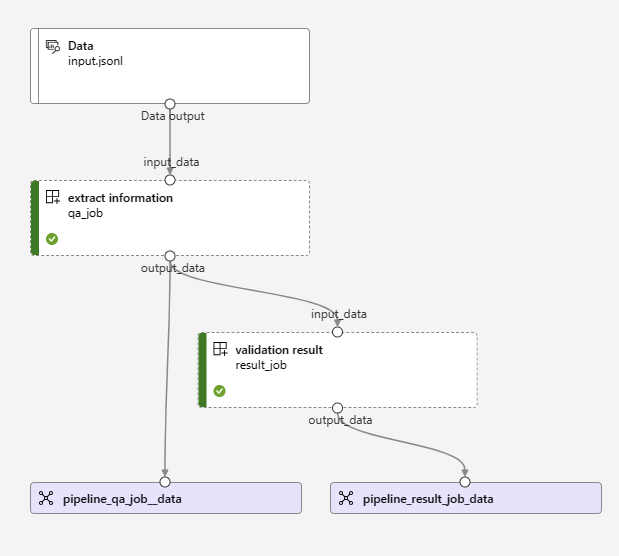

# LangChainAMLPipeline

## Overview

For each round in LangChain, we would like to trigger a validation step to
verify the correctness of the function.

In order to do so, for each function in LangChain, we prepare a test dataset
which consists of the input to the function, and expected result from it.

In the pipeline, we feed the input to the LangChain function and get actual
result, and feed the expected result and actual result to a validation step
in the pipeline to verify whether these two results match.

## Pipeline

